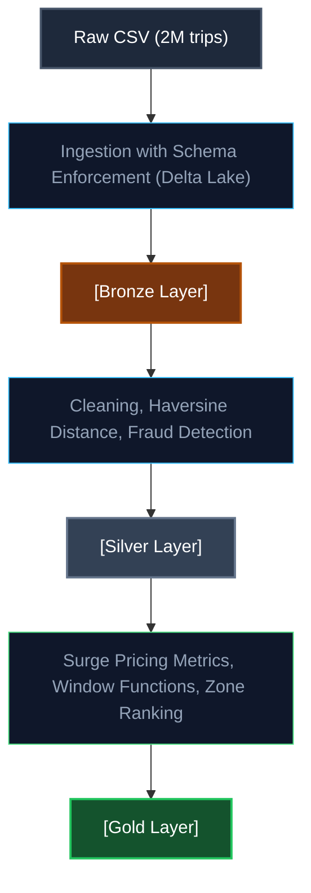

# Ride-Hailing Fraud and Surge Pricing Engine

A production-style Data Engineering pipeline simulating real-world Uber/Bolt data infrastructure built with PySpark, Delta Lake, and Docker.

---

## Architecture and Data Flow



---

## Tech Stack

| Tool               | Purpose                        |
| :----------------- | :----------------------------- |
| **PySpark 3.5**    | Distributed data processing    |
| **Delta Lake 3.1** | ACID transactions, time travel |
| **Docker**         | Reproducible environment       |
| **Python 3.11**    | Pipeline orchestration         |

---

## Key Features

### Fraud Detection

- **ghost_trip**: driver coordinates unchanged after trip completion.
- **speed_anomaly**: computed via Haversine formula, flags trips exceeding 150 km/h.

### Surge Pricing Engine

- Demand/supply ratio per geographic grid zone (2 decimal lat/lon precision).
- 15-minute rolling time windows.
- Dynamic multiplier: 1.0x to 2.5x based on zone saturation.

### Medallion Architecture

- **Bronze**: raw data preserved as-is.
- **Silver**: cleaned, enriched, fraud-labeled.
- **Gold**: business-ready aggregations.

---

## Quick Start

Prerequisites: Docker Desktop

```bash
git clone https://github.com/YOUR_USERNAME/ride-hailing-pipeline.git
cd ride-hailing-pipeline

# Generate 2M mock trip records
docker build -t ride-hailing-pipeline .
docker run --rm -v ${PWD}/data:/app/data ride-hailing-pipeline python src/data_generator.py

# Run full pipeline: Bronze -> Silver -> Gold
docker run --rm -v ${PWD}/data:/app/data ride-hailing-pipeline python src/transformations.py
```

---

## Project Structure

```text
ride-hailing-pipeline/
├── data/
│   ├── raw/                 # Generated CSV (gitignored)
│   ├── bronze/              # Delta Lake - raw ingested
│   ├── silver/              # Delta Lake - cleaned + fraud labeled
│   └── gold/                # Delta Lake - surge metrics
├── src/
│   ├── spark_session.py     # SparkSession + Delta config
│   ├── data_generator.py    # Mock data generation (2M records)
│   ├── ingestion.py         # CSV -> Bronze
│   └── transformations.py   # Bronze -> Silver -> Gold
├── tests/
│   └── test_transformations.py
├── notebooks/
│   └── eda.ipynb
├── Dockerfile
├── docker-compose.yml
├── requirements.txt
└── .gitignore
```

---

## Dataset

2,000,000 synthetic trip records with:

- GPS coordinates within NYC bounding box.
- 5,000 unique drivers / 50,000 unique riders.
- ~3% injected fraud patterns (ghost trips + speed anomalies).
- 90-day time range.
