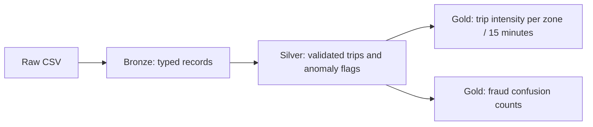

# Ride-Hailing Fraud & Trip Intensity Pipeline

A production-inspired batch data engineering project using PySpark 3.5, Delta Lake 3.1,
Python 3.11 and Docker. Synthetic ride records pass through Bronze, Silver and Gold
tables to identify suspicious trips and summarize completed-trip activity.

## Data flow


```mermaid
flowchart LR
    CSV[Raw CSV] --> Bronze[Bronze: typed records]
    Bronze --> Silver[Silver: validated trips and anomaly flags]
    Silver --> Gold[Gold: trip intensity per zone / 15 minutes]
    Silver --> Evaluation[Gold: fraud confusion counts]
```

- **Bronze:** explicit schema; malformed CSV or incompatible headers fail the run.
- **Silver:** completed trips with valid IDs, timestamps, coordinates, positive duration
  and finite nonnegative fare. Exact duplicates collapse; all conflicting versions
  of an ID are excluded. Source CSV remains available for investigation.
- **Features:** Haversine straight-line distance, speed and rounded geographic grid.
- **Anomaly rules:** speed over 150 km/h or distance below 10 meters. These are
  suspicious patterns, not proof of fraud.
- **Gold intensity:** unflagged trip count per grid cell per fixed 15-minute UTC
  interval, unique drivers, average fare/distance and zone ranking. Ties share a rank.
  Only observed zones/windows appear. This measures completed-trip activity, not
  unmet demand, available supply or a pricing multiplier.
- **Evaluation:** counts by synthetic `fraud_label` versus predicted `is_fraud`,
  restricted to Silver trips. Labels never enter prediction logic.

## Quick start

Prerequisites: Docker Desktop running with Linux containers. First build requires
internet for Python packages; the first Spark session downloads Delta JVM dependencies.

```bash
git clone https://github.com/HeldiLami/ride-hailing-pyspark-pipeline.git
cd ride-hailing-pyspark-pipeline
docker compose build
docker compose run --rm spark-app python -m src.pipeline --generate --trips 10000
```

The command generates a small reproducible demo and runs CSV → Bronze → Silver → Gold.
It prints row counts, elapsed time, sample intensity rows and fraud confusion counts.

Reprocess the existing CSV without generating data:

```bash
docker compose run --rm spark-app
```

Larger synthetic run (replaces the raw CSV):

```bash
docker compose run --rm spark-app python -m src.pipeline --generate --trips 2000000 --seed 42
```

Each run **overwrites** its output Delta tables. This is a full batch refresh, not
incremental ingestion. Use `--data-dir data/demo` for an independent dataset.
The generator holds its dataset in Pandas memory; start small on limited hardware.

If upgrading from the previous version, regenerate the CSV: the unused
`surge_multiplier` input column has been removed. Old `data/gold/surge_metrics`
tables are no longer read or updated.

## Tests and development

```bash
docker compose run --rm spark-app python -m pytest -q
docker compose run --rm spark-app ruff check src tests
```

Tests cover distance, time boundaries, invalid data, duplicate policy, anomaly
thresholds, ground-truth independence, intensity counts/ranking, deterministic
generation and a real CSV → Delta integration run repeated twice.
GitHub Actions runs these checks with Python 3.11 and Java 17.

For local development use Python 3.11 and Java 17:

```bash
python -m venv .venv
# Activate .venv using your shell's activation command.
python -m pip install -r requirements-dev.txt
python -m src.pipeline --generate --trips 10000
python -m pytest -q
```

Notebook dependencies are optional: `pip install -r requirements-notebook.txt`.
The EDA notebook describes synthetic raw data; it is not an evaluation of the
fraud detector. Open it from `notebooks/` after generating data.

## Structure

```text
src/
  data_generator.py     Seeded synthetic CSV generation
  ingestion.py          CSV schema and Bronze writer
  transformations.py    Testable DataFrame functions and layer writers
  spark_session.py      Local Spark / Delta configuration (UTC)
  pipeline.py           CLI and full batch orchestration
tests/                  Unit and Delta integration tests
notebooks/eda.ipynb      Raw-data exploratory charts
.github/workflows/      Automated lint and test checks
data/                   Generated data and Delta tables (gitignored)
```

## Input and outputs

CSV headers must match the order in `src/ingestion.py:SCHEMA`:

```text
trip_id,driver_id,rider_id,vehicle_type,payment_method,pickup_lat,pickup_lon,dropoff_lat,dropoff_lon,trip_duration_sec,base_fare_usd,request_timestamp,status,fraud_label
```

Timestamps use `yyyy-MM-dd HH:mm:ss` and are interpreted as UTC.
For external data without labels, provide an empty `fraud_label` column; confusion
counts then have no ground-truth evaluation meaning.

| Path | Contents |
| --- | --- |
| data/raw/trips.csv | Synthetic or supplied CSV |
| data/bronze/trips | Typed input records |
| data/silver/trips | Validated completed trips with features and flags |
| data/gold/trip_intensity | Activity by zone and 15-minute interval |
| data/gold/fraud_evaluation | Ground-truth/prediction confusion counts |

## Dataset and limitations

Verified Docker demo (`--trips 10000 --seed 42`):

| Result | Count |
| --- | ---: |
| Bronze input rows | 10,000 |
| Silver completed, valid trips | 8,523 |
| Gold zone/window groups | 8,260 |
| Retained injected ghost trips correctly flagged | 131 |
| Retained injected speed anomalies correctly flagged | 124 |
| Otherwise normal synthetic trips flagged for speed | 6 |

The eight automated tests also passed locally in Docker. These demo counts are
not a benchmark on real ride-hailing data.

The generator supports 2 million records, 5,000 possible drivers and 50,000 possible
riders, with uniformly sampled timestamps over 90 days and roughly 3% injected
anomaly patterns. Pickups lie within an NYC bounding box; dropoffs, especially
injected anomalies, may be outside it. The simulation does not model road networks,
rush-hour demand or driver availability. Small samples may not contain every ID.

Haversine distance is not road distance. Normal synthetic trips can also trigger
rules, so perfect fraud accuracy is not assumed. Row counts and timings depend on
the actual run and hardware; no benchmark or accuracy claim is made here.

The project deliberately uses local batch processing. Streaming, orchestration
services and incremental updates are outside its current scope.
